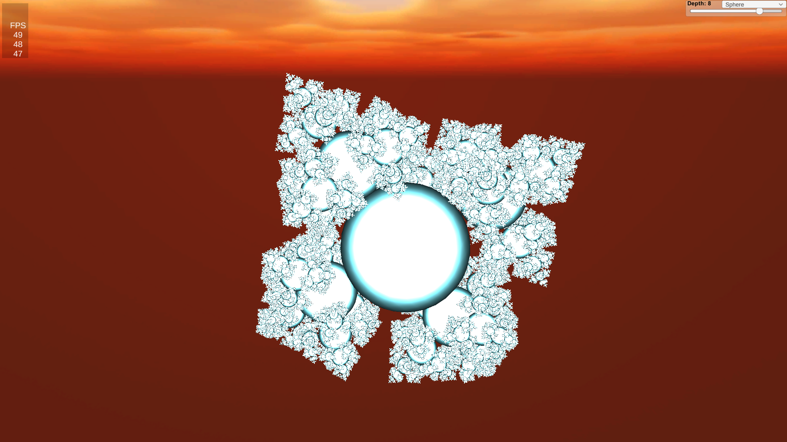

# Tetrahedron
## By Muhammad Muneeb (/vacuitydev)
### [Site: www.vacuity.online](www.vacuity.online)
### [LinkedIn: /in/muhammad-muneeb-39b238218/](https://www.linkedin.com/in/muhammad-muneeb-39b238218/)

## What is this
Tetrahedron is a tetrahedral fractal generator. It works on Cubes and Spheres. On a GTX 1660 ti, it can render a fractal consisting of 97,656 spheres at >30 fps (realtime).
It is essentially a toy project meant to showcase my proficiency with the Jobs system and Burst compiler.
## Video
Check out the video for what it looks like at runtime.